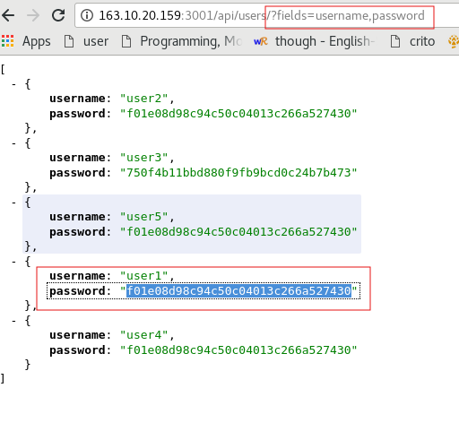
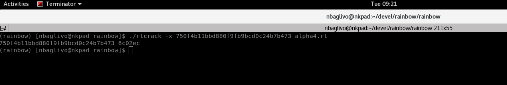
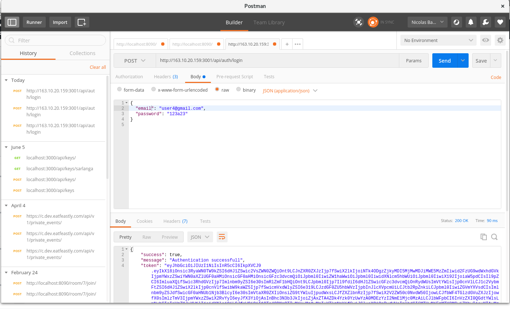
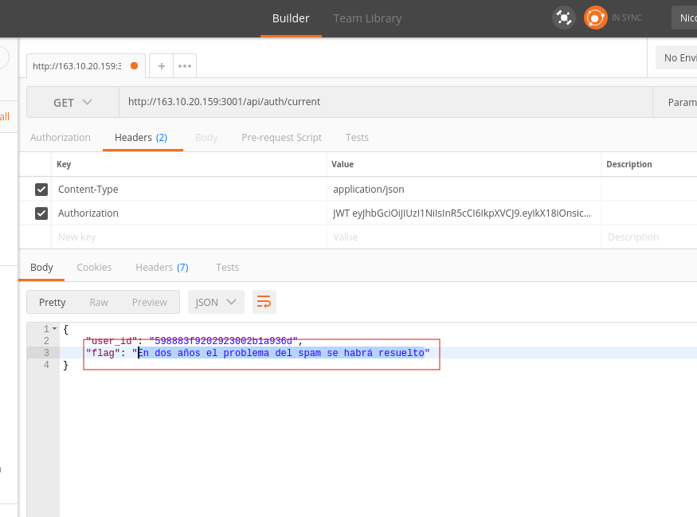
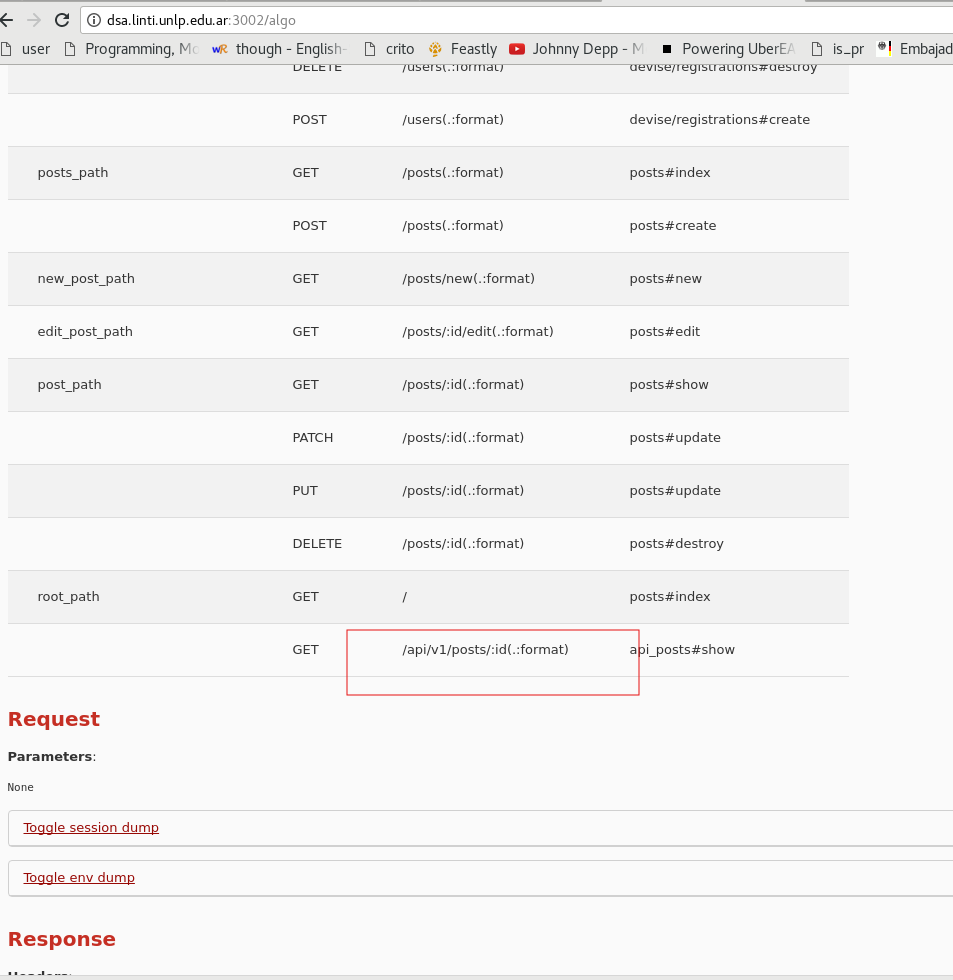
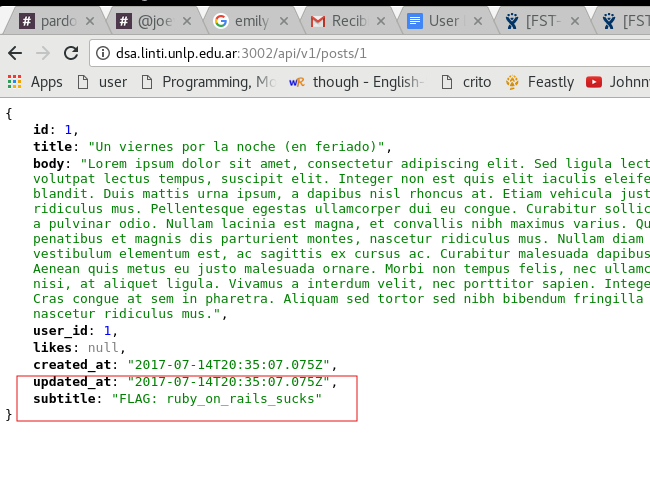
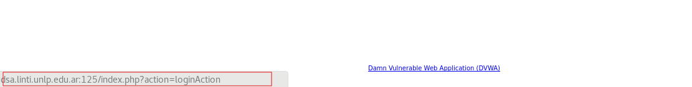
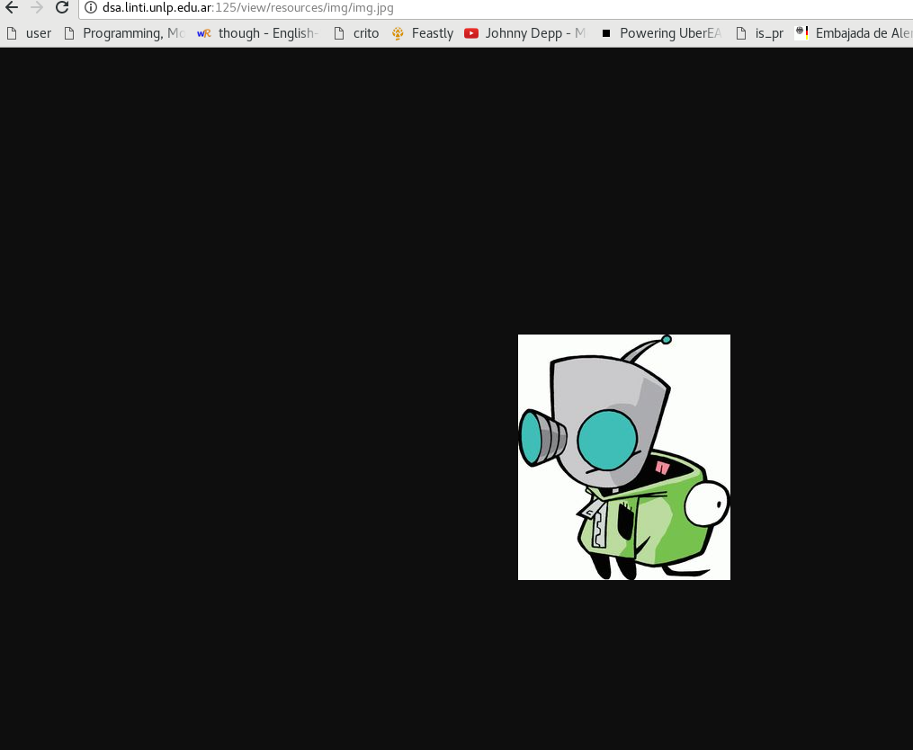
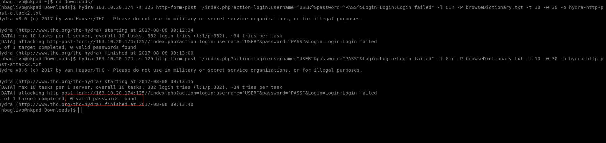

# Resumen DSA

## Grupo 2017 - 12

1. En la documentación se lee que el endpoint acepta un parámetro **fields** para filtrar las propiedades del usuario que querramos obtener, podemos abusar de esto para obtener los password de los usuarios.

2. Ahora tengo el password hasheado en md5, para conseguir el password original utilizo una rainbow table, md5 es rapido asi que hay chances de crackearlo rapidamente.

3. Una vez que tenemos el password podemos loguearnos !

4. Finalmente si le pegamos al endpoint /auth/current podemos obtener la información del usuario logueado y el flag !

## Grupo 2017 - 11

1. Puse cualquier path en la url para chequear si estaba en debug mode. Me encontré con todas las rutas de la app y noté que había una API.

2. Le pegue a la API con el id de un post y encontré el flag.

### Grupo 2017 - 6 - ** Intento fallido **

1. Encontré un link a un archivo que parecía ser un diccionario.

2. Probé un ataque de diccionario contra el login pero no funcionó

3. Luego encontré una imagen sospechosa de un personaje animado, no recordaba el nombre pero google images me dijo que era Gir

4. Volví a hacer un ataque de diccionario pero esta vez usando como usuario  Gir, no hubo suerte

